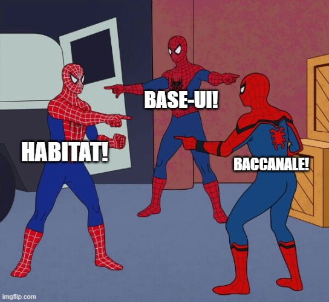

# Habitat - Casavo Design System Library

## 🚧🚧 WORK IN PROGRESS 🚧🚧

> Welcome to the Casavo design system repository! This is where you can find all the components, guidelines and resources to create amazing user experiences for Casavo. Whether you are a developer, a designer or a product manager, you will find everything you need to get started. Explore the repository and have fun!



## Design first

This project is a design driven project, which means we care a lot about the user experience and the aesthetics of our product. We want to create something that is beautiful, functional and easy to use.

Everything in this codebase is a reflection of what has been defined on the related [Figma board](https://www.figma.com/file/0vYcLbHGHFIJ44hFI45WQJ/%F0%9F%9A%80-Habitat?type=design).

## Built on top of

- [React](https://react.dev/) + [Typescript](https://www.typescriptlang.org/) - the library for web and native user interfaces
- [Vanilla Extract](https://vanilla-extract.style/) / Emotion - zero-runtime stylesheets in typeScript
- [Storybook](https://storybook.js.org/) - frontend workshop for building UI components and pages in isolation
- [Vite.js](https://vitejs.dev/) - next Generation Frontend Tooling

## What's included?

Brief checklist of the component that will be included in the project:

- Typography
  - `<Display />`, `<H1 />`, `<H2 />`, `<H3 />`, `<H4 />` will represent the matching entities
  - `<Body />` will act as counterpart of `BodyL` and `BodyM`
  - `Description`, `Caption` and `Small` are still under discussion
  - `<List />`
- UI Components
  - `<Button />`
  - `<Badge />`
  - `<TextLink />` ??
  - `<Navbar />`
  - `<Link />`
  - `<Switch />`
  - `<Tags />`
  - `<Toast />`
- Form components
  - `<Input />`
  - `<Checkbox />`
  - `<Radio />`
  - `<Alert />`
  - `<Chip />`
- Utilities
  - media queries
  - design tokens

## Using Habitat in your project

> **NOTE:** currently Habitat is **not** available as a public NPM package.

install the package in your project (_you can use whatever package manager you prefer_)

```bash
$ npm i @casavo/habitat
```

import the `HabitatTheme` global class and apply it to top level node of you application

```typescript
// App.tsx - assuming it is a Next.js application

import { FC } from "react";
import { HabitatTheme } from "@casavo/habitat";

const App = ({ children }): FC => {
  return (
    <div id="app" className={HabitatTheme}>
      {children}
    </div>
  );
};

export default App;
```

then import and use the components that you need in yout code

```typescript
// MyComponent.tsx
import { Button } from "@casavo/habitat";

export const MyComponent = (): FC => {
  const variant: string = "secondary";

  const doSomething = (): void => window.alert("button clicked!");

  return (
    <div>
      <Button variant={variant} onClick={doSomething} />
    </div>
  );
};
```

## Local development

Clone the repo and cd into it

```bash
$ git clone git@github.com:casavo/habitat.git
$ cd habitat
```

install the NPM dependencies

```bash
$ npm ci
```

start the Storybook development server

```bash
$ npm run dev
```

the Storybook instance will automatically open in your browser at `http://localhost:6006/`.

Please refert to the [docs](docs/development.md) for in depth info on how to work locally.

## How to participate?

> Before opening issues or pull requests plaese read our [code of conduct](CODE_OF_CONDUCT.md), then
> refer to the guidelines described in the "[Contributing](CONTRIBUTING.md)" section.

For information, requests, bug and inconsistencies alerts join the `#habitat-design-system` Slack channel.

## Updating the Design Tokens

This library heavily relies on a set of Design Tokens defined in the Figma board. When the tokens changes on the source board, the designers exports a new `.json` file that the developers can integrate in the repo and use by following this steps:

1. copy the `.json` generated by Figma in the root folder of the project

   - if the file has the same name of the existing one just overwrite it
   - if the file name change delete the existing one and update the `source` value in the `dictionary.config.json` file

2. from the terminal execute `$ npm run update:tokens`
3. this will generate a new plain `.json` token file in the `src/utils` folder
4. commit the changes, push the code and create a new PR as described in the "[Contributing](CONTRIBUTING.md)" section

## License

Code is distributed under the [Apache 2.0](LICENSE), Casavo logo and brand are registered trademarks.
